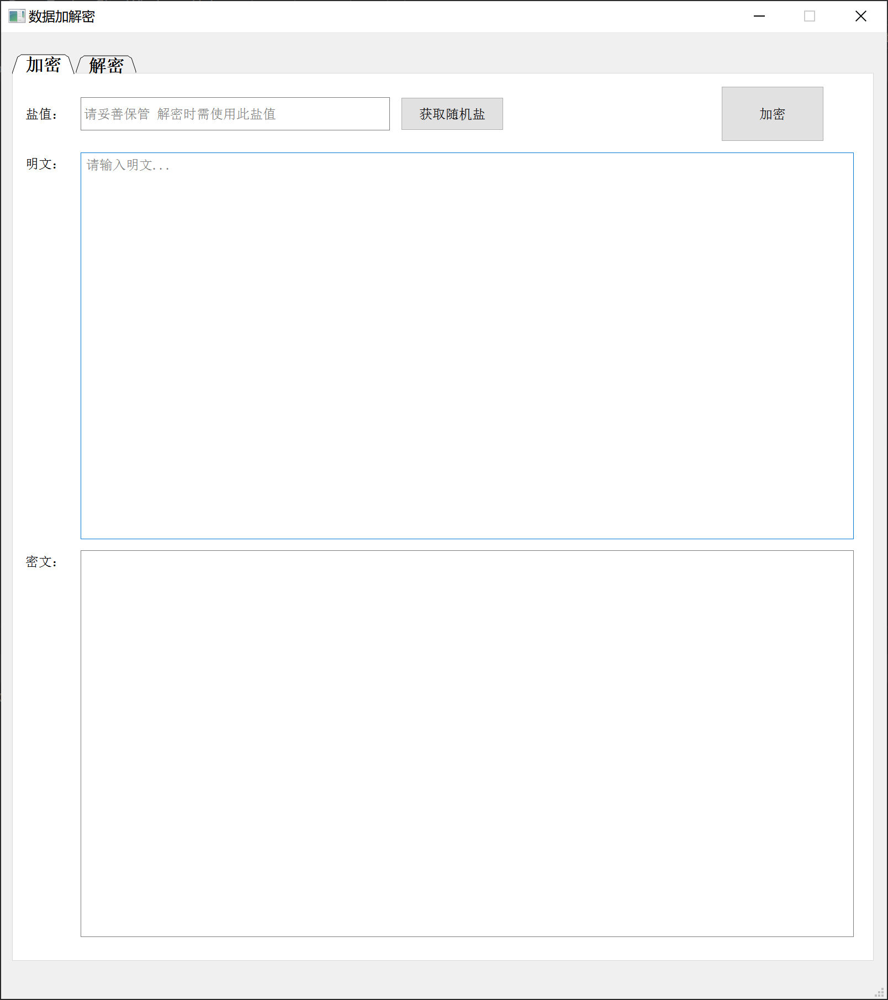
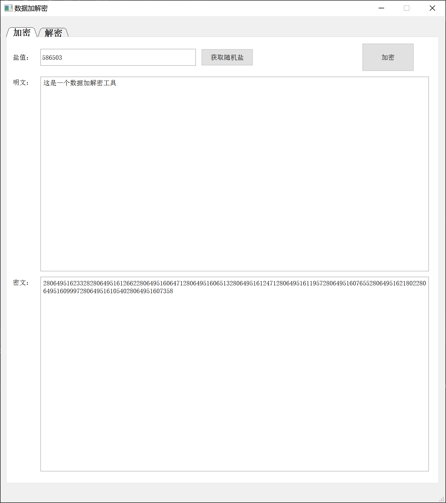
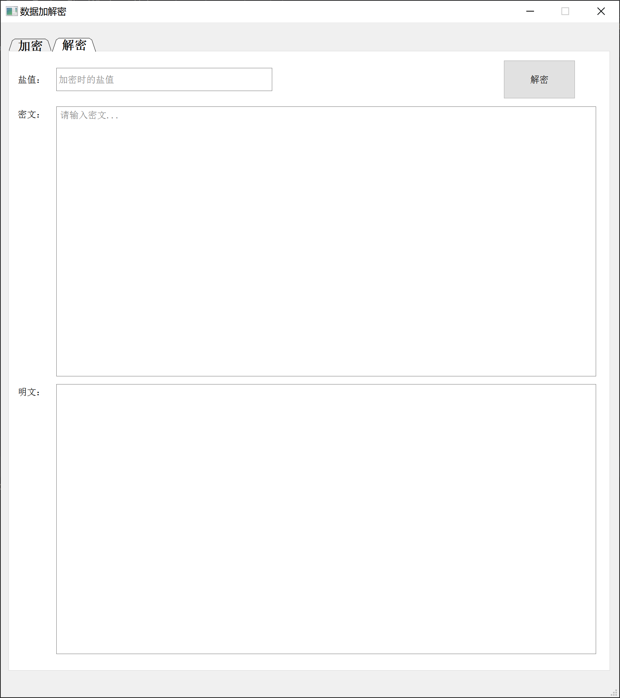
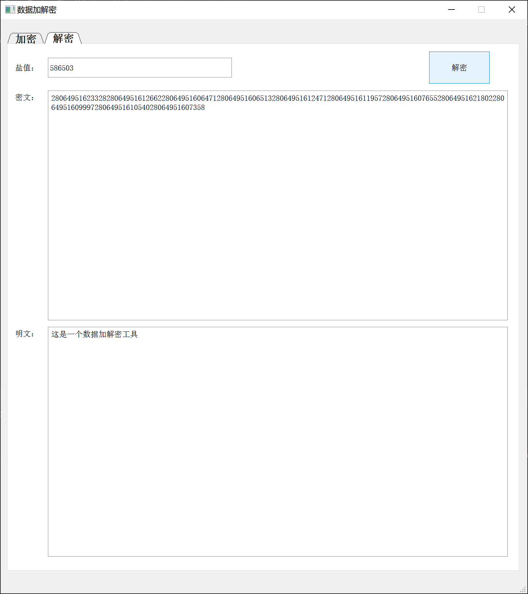

# README

这是一个 根据指定的盐 通过自定义算法对明文/密文 进行加密/解密 的桌面工具

## Table of Contents

- [Background](#background)
- [Install](#install)
- [Usage](#usage)
  - [Generator](#generator)
- [Badge](#badge)
- [Example Readmes](#example-readmes)
- [Related Efforts](#related-efforts)
- [Maintainers](#maintainers)
- [Contributing](#contributing)
- [License](#license)

## Background

平时需要记录的各个账号密码等敏感信息比较多
- 直接明文记录（不安全）
- 通过现有的加解密工具（由于算法是基本是一样的 且解密时较麻烦 故不采用）
- 一般加解密工具 只要解密破解一个密文后 算法就暴露了（算法不是动态的）

基于以上痛点诞生出了此工具（EncryptionUtil）

## Install

****

| 工具        | 版本      |
|:-----------|:---------|
| PyCharm工具 | 2021.1.1 |
| Python工具  | 3.9.5    |
| PyQt5      | 5.15.4   |

****

## Usage

### Generator

暂无

## Badge

暂无

## Example Readmes

效果展示

1、加密默认页面

2、加密后页面  

3、解密默认页面  

4、解密后页面  

## Related Efforts

暂无

## Maintainers

暂无

## Contributing

暂无

## License

[博客](https://www.cnblogs.com/danhuai) |
[GitHub](https://github.com/JarvisFree) | © 维斯
